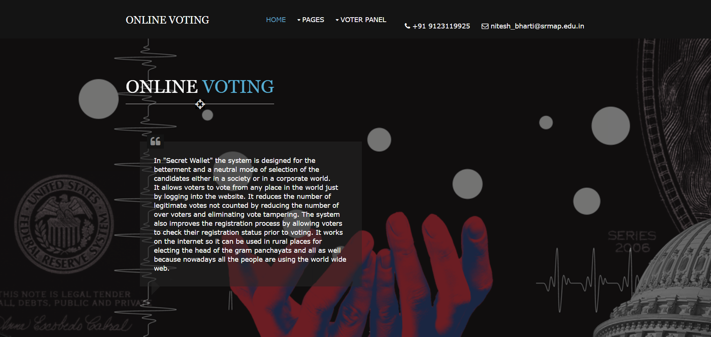

# Secret Wallet (E Voting) 

***Description***
> During this pandemic situation it has become very immportant to be safe and followw all the necessary precations to stay safe. In such situation, many regular works have been affected including the voting scenario in various sectors if observed carefully.

> The system is designed for the betterment and a neutral mode of selection of the
candidates either in a society or in a corporate world. It allows voters to vote from any place in the world just by logging into the
website. 
> It reduces the number of legitimate votes not counted by reducing the
number of over voters and eliminating vote tampering. The system also improves
the registration process by allowing voters to check their registration status prior to
voting. It works on the internet so it can be used in rural places for electing the
head of the gram panchayats and all as well because nowadays all the people are
using the world wide web.

> The technologies to be used in building the project are DBMS, PHP, SQL for the
back-end part in constructing the Database and connecting it to the front end

***WHO CAN USE THE APPLICATION IN REAL LIFE***
> Our application can be used by a large variety of people to cast votes on a small
scale as well as large scale.
> It can be implemented in electing ahead for a particular organization, managing union leaders, and secretary elections in factories and society respectively. 
> It can also be implemented in corporate sectors to choose their representatives by keeping all safety measures in mind and voting perfectly at a fair means.

***LAnding Page***

***Category*** :
> Software

***Tech Stack*** :

- DBMS
- PHP
- SQL
- HTML/CSS and JavaScript
